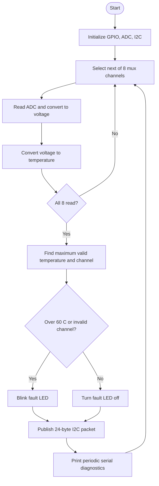

```mermaid
flowchart TD
    A([Start]) --> B[Initialize GPIO, ADC, I2C]
    B --> C[Select next of 8 mux channels]
    C --> D[Read ADC and convert to voltage]
    D --> E[Convert voltage to temperature]
    E --> F{All 8 read?}
    F -- No --> C
    F -- Yes --> G[Find maximum valid temperature and channel]
    G --> H{Over 60 C or invalid channel?}
    H -- Yes --> I[Blink fault LED]
    H -- No --> J[Turn fault LED off]
    I --> K[Publish 24-byte I2C packet]
    J --> K
    K --> L[Print periodic serial diagnostics]
    L --> C
```
