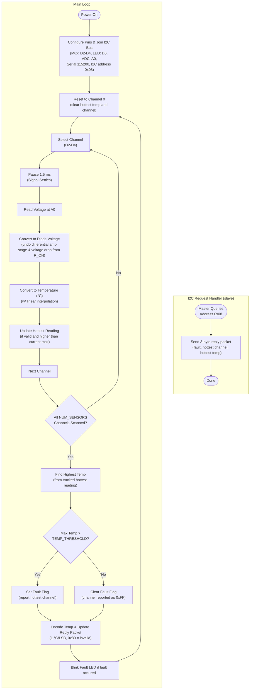

```mermaid
flowchart TD
    subgraph ISR ["I2C Request Handler (slave)"]
        direction TB
        X(["Master Queries<br/>Address 0x08"]) --> Y["Send 3-byte reply packet<br/>(fault, hottest channel, hottest temp)"]
        Y --> Z(["Done"])
    end

    subgraph MAIN ["Main Loop"]
        direction TB
        A(["Power On"]) --> B["Configure Pins & Join I2C Bus<br/>(Mux: D2-D4, LED: D6, ADC: A0,<br/>Serial 115200, I2C address 0x08)"]
        B --> C["Reset to Channel 0<br/>(clear hottest temp and channel)"]
        C --> D["Select Channel<br/>(D2-D4)"]
        D --> E["Pause 1.5 ms<br/>(Signal Settles)"]
        E --> F["Read Voltage at A0"]
        F --> G["Convert to Diode Voltage<br/>(undo differential amp stage & voltage drop from R_ON)"]
        G --> H["Convert to Temperature (°C)<br/>(w/ linear interpolation)"]
        H --> I["Update Hottest Reading<br/>(if valid and higher than current max)"]
        I --> J["Next Channel"]
        J --> K{"All NUM_SENSORS<br/>Channels Scanned?"}
        K -- No --> D
        K -- Yes --> L["Find Highest Temp<br/>(from tracked hottest reading)"]
        L --> M{"Max Temp ><br/>TEMP_THRESHOLD?"}
        M -- Yes --> N["Set Fault Flag<br/>(report hottest channel)"]
        M -- No --> O["Clear Fault Flag<br/>(channel reported as 0xFF)"]
        N --> P["Encode Temp & Update Reply Packet<br/>(1 °C/LSB, 0x80 = invalid)"]
        O --> P
        P --> Q["Blink Fault LED if fault occured"]
        Q --> C
    end
```
