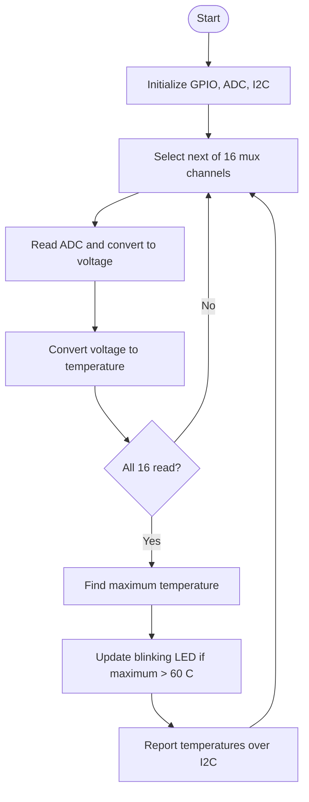

```mermaid
flowchart TD
    A([Start]) --> B[Initialize GPIO, ADC, I2C]
    B --> C[Select next of 16 mux channels]
    C --> D[Read ADC and convert to voltage]
    D --> E[Convert voltage to temperature]
    E --> F{All 16 read?}
    F -- No --> C
    F -- Yes --> G[Find maximum temperature]
    G --> H[Update blinking LED if maximum > 60 C]
    H --> I[Report temperatures over I2C]
    I --> C
```
